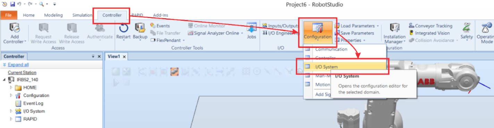
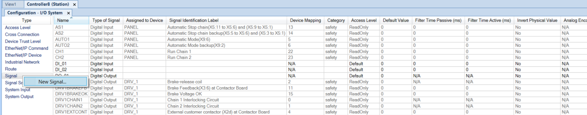
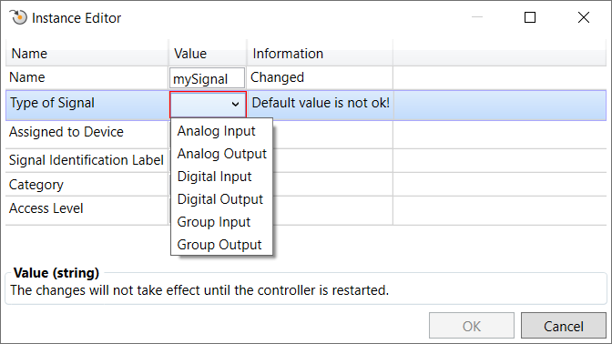
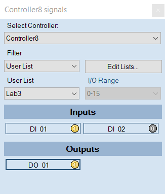

# robotics-abbIRB140-IO
Repositoty for practices with an industrial robot model ABB IRB140 using Digital Inputs &amp; Digital Outputs.

> ## Contributors
> 
> - [Camilo Andrés Borda Gil](https://github.com/Canborda) (caabordagi@unal.edu.co)
> - Paula Sofía Medina Diaz (psmedinadi@unal.edu.co)
> - Robinson Jair Orduxz Gomez (rjorduzg@unal.edu.co)

---
# Input/Output Definition

The goal was to command different paths or sequences previously defined (on [this repository](https://github.com/Canborda/robotics-abbIRB140)) with the usage of __digital inputs__. In Robot Studio is possible to make simulation with "virtual" inputs & outputs, and in the physical laboratory we use industrial buttons to send a signal to the controller.

### I/O in RobotStudio

- Access to the I/O editor at `Controller` -> `Configuration` -> `I/O System`.
<p align="center"></p>

- A view with all I/O used in the controller will be open, but we can also define custom inputs & outputs. Right-click on `Signal` will raise a new window to create a custom signal.
<p align="center"></p>

- On the Instance Editor you will be able to select whether it is an input or an output and the type.
<p align="center"></p>

- With the `I/O simulator` you can set input signals and monitor output signals.
<p align="center"></p>

### I/O Module

The IRC5 controller has already configured an I/O module `3HAC025917-001/00 DSQC 652`, and we can access to digital inputs & outputs via a control panel like the shown in the image.
<p align="center"></p>

---
# RAPID Code

Within RAPID language is possible to define basic if/else sentences and loops, so the logic for this assignment was very straightforward. The algorithm consists on an infinite loop that waits until any digital input (`DI_01`, `DI_02`) has the value toggled on, and then execute the respective path procedure.

```
PROC main()
    Path_Start;
    RESET DO_01;
    WHILE TRUE DO
        IF DI_01 = 1 THEN
            Path_Start;
            SET DO_01;
            Path_B;
            Path_C;
            RESET DO_01;
        ELSEIF DI_02 = 1 THEN
            Path_Maintenance;
        ENDIF
    ENDWHILE
ENDPROC
```

---